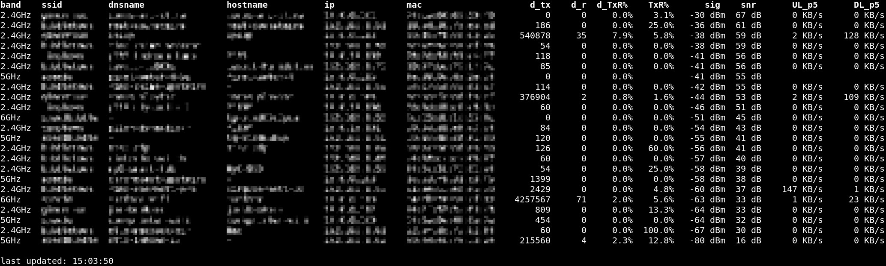

# u6e-scanner
real-time client scanner for Ubiquiti U6 Enterprise
verified working on firmware 6.8.2.15592 (March 2026)

### notes and caveats

* usage and column documentation reside in comments at the top of the script
* this script does not modify anything on the system other than caching data in `/tmp/u6e-scanner`, but don't take my word for it - review the code to verify it is safe and secure
* AI tools were used to generate much of this code - do not use it if this is an issue for you
* this may break with new U6E firmware updates
* this may or may not work on other ubiquiti WAPs
